# Antigravity Tools 🚀
> 專業級 AI 帳號管理與協議代理系統 (v4.8.1)

<div align="center">
  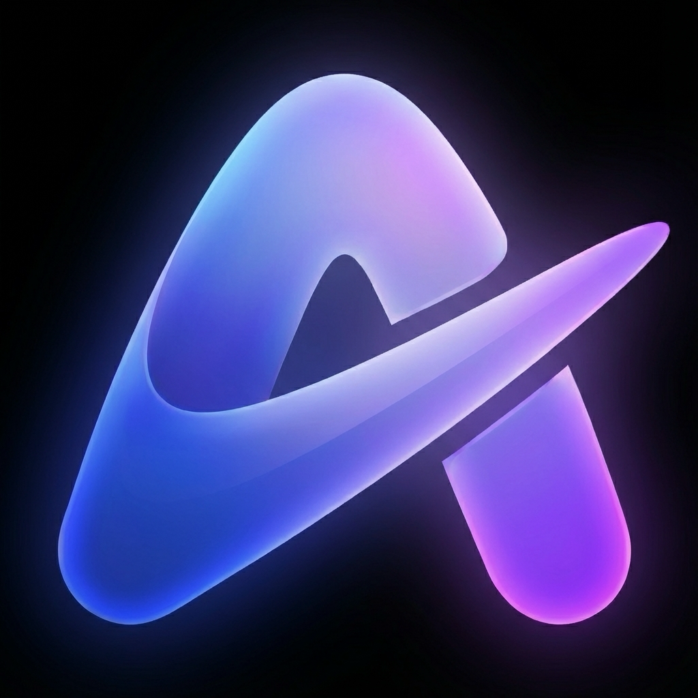
  <h3>Antigravity Tools</h3>
  <p>多平臺自動化運維與多帳號矩陣排程控制檯</p>

  <p>
    <a href="https://github.com/lbjlaq/Antigravity-Manager/releases">
      
    </a>
    <a href="https://github.com/lbjlaq/Antigravity-Manager">
      
    </a>
    
    
  </p>

  <p>
    <a href="#-核心功能">核心功能</a> • 
    <a href="#-介面導覽">介面導覽</a> • 
    <a href="#-技術架構">技術架構</a> • 
    <a href="#-安裝指南">安裝指南</a> • 
    <a href="#-快速接入">快速接入</a>
  </p>

  <p>
    <strong>繁體中文</strong> | 
    <a href="./README_EN.md">English</a>
  </p>
</div>

---

**Antigravity Tools** 是一個專為開發者和 AI 愛好者設計的全功能桌面應用。它將多帳號管理、協議轉換和智慧請求排程完美結合，為您提供一個穩定、極速且成本低廉的 **本地 AI 中轉站**。

透過本應用，您可以將常見的 Web 端 Session (Google/Anthropic) 轉化為標準化的 API 介面，消除不同廠商間的協議鴻溝。

## 🌟 深度功能解析 (Detailed Features)

### 1. 🎛️ 智慧帳號儀表盤 (Smart Dashboard)
*   **全域性實時監控**: 一眼洞察所有帳號的健康狀況，包括 Gemini Pro、Gemini Flash、Claude 以及 Gemini 繪圖的 **平均剩餘配額**。
*   **最佳帳號推薦 (Smart Recommendation)**: 系統會根據當前所有帳號的配額冗餘度，實時演算法篩選並推薦“最佳帳號”，支援 **一鍵切換**。
*   **活躍帳號快照**: 直觀顯示當前活躍帳號的具體配額百分比及最後同步時間。

### 2. 🔐 強大的帳號管家 (Account Management)
*   **OAuth 2.0 授權（自動/手動）**: 新增帳號時會提前生成可複製的授權連結，支援在任意瀏覽器完成授權；回撥成功後應用會自動完成並儲存（必要時可點選“我已授權，繼續”手動收尾）。
*   **多維度匯入**: 支援單條 Token 錄入、JSON 批次匯入（如來自其他工具的備份），以及從 V1 舊版本資料庫自動熱遷移。
*   **閘道器級檢視**: 支援“列表”與“網格”雙檢視切換。提供 403 封禁檢測，自動標註並跳過權限異常的帳號。

### 3. 🔌 協議轉換與中繼 (API Proxy)
*   **全協議適配 (Multi-Sink)**:
    *   **OpenAI 格式**: 提供 `/v1/chat/completions` 端點，相容 99% 的現有 AI 應用。
    *   **Anthropic 格式**: 提供原生 `/v1/messages` 介面，支援 **Claude Code CLI** 的全功能（如思思維鏈、系統提示詞）。
    *   **Gemini 格式**: 支援 Google 官方 SDK 直接呼叫。
*   **智慧狀態自愈**: 當請求遇到 `429 (Too Many Requests)` 或 `401 (Expire)` 時，後端會毫秒級觸發 **自動重試與靜默輪換**，確保業務不中斷。

### 4. 🔀 模型路由中心 (Model Router)
*   **系列化對映**: 您可以將複雜的原始模型 ID 歸類到“規格家族”（如將所有 GPT-4 請求統一路由到 `gemini-3-pro-high`）。
*   **專家級重定向**: 支援自定義正規表示式級模型對映，精準控制每一個請求的落地模型。
*   **智慧分級路由 (Tiered Routing)**: [新] 系統根據帳號型別（Ultra/Pro/Free）和配額重置頻率自動優先順序排序，優先消耗高速重置帳號，確保高頻呼叫下的服務穩定性。
*   **後臺任務靜默降級**: [新] 自動識別 Claude CLI 等工具生成的後臺請求（如標題生成），智慧重定向至 Flash 模型，保護高階模型配額不被浪費。

### 5. 🎨 多模態與 Imagen 3 支援
*   **高階畫質控制**: 支援透過 OpenAI `size` (如 `1024x1024`, `16:9`) 引數自動對映到 Imagen 3 的相應規格。
*   **超強 Body 支援**: 後端支援高達 **100MB** (可配置) 的 Payload，處理 4K 高畫質圖識別綽綽有餘。

## 📸 介面導覽 (GUI Overview)

| | |
| :---: | :---: |
| 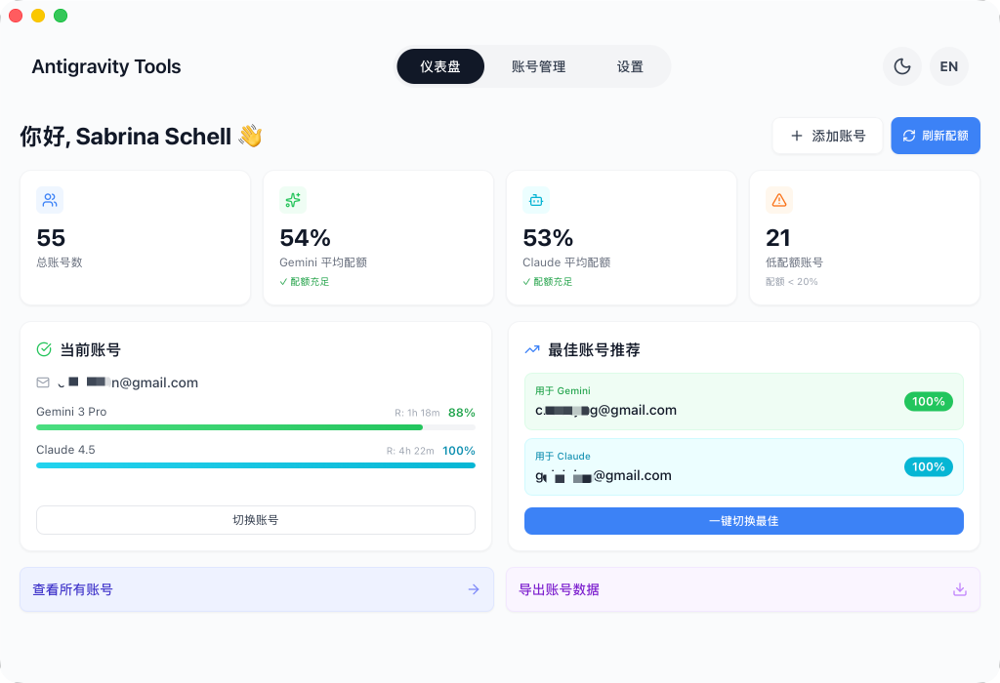 <br> 儀表盤 | 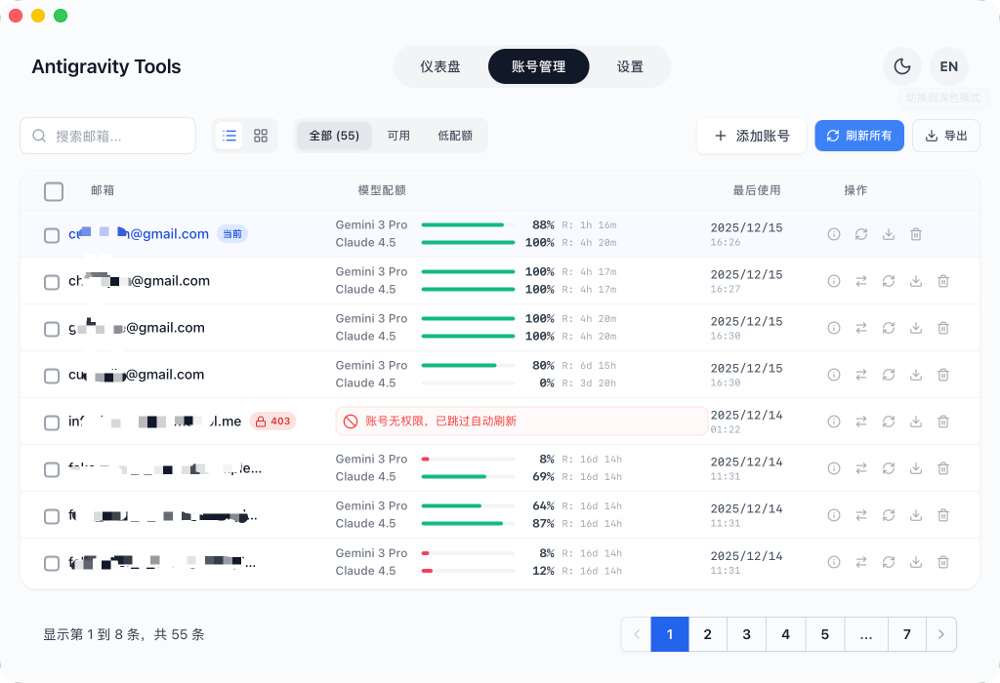 <br> 帳號列表 |
| 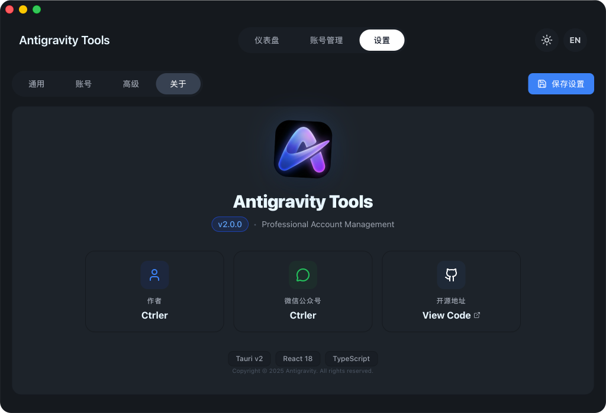 <br> 關於頁面 | 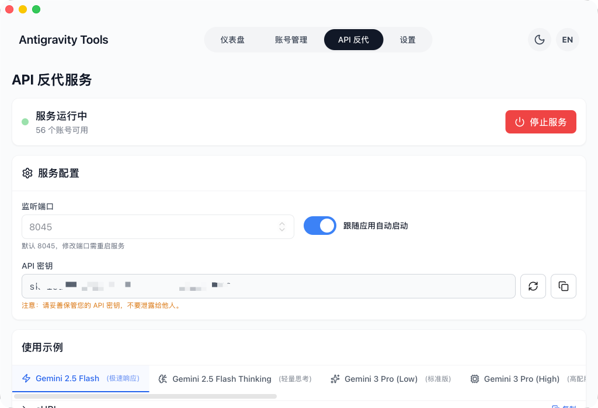 <br> API 反代 |
| 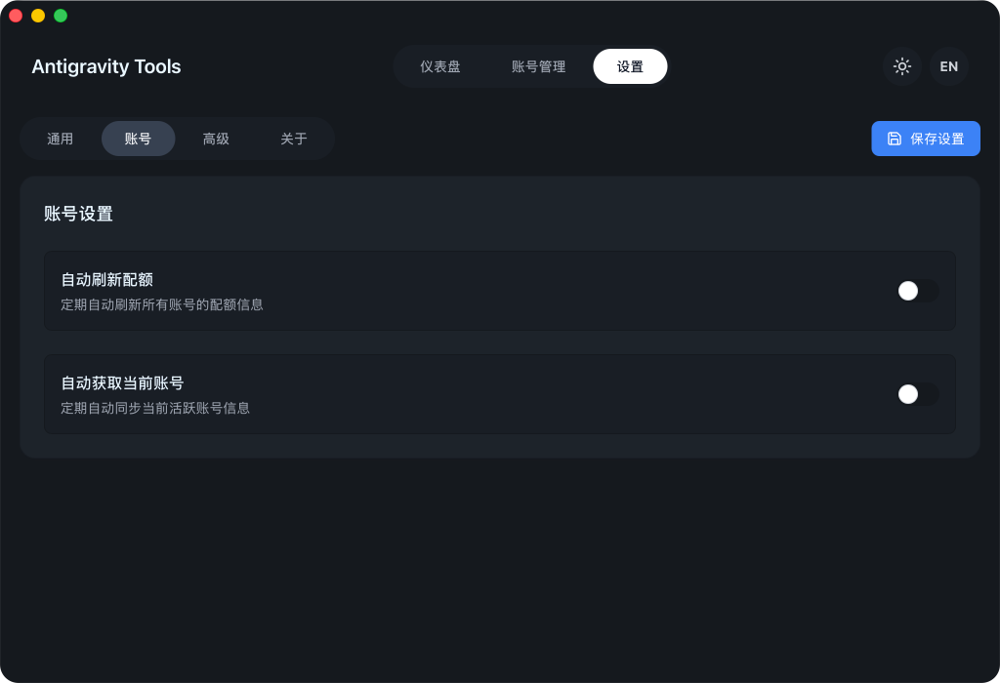 <br> 系統設定 | |

### 💡 使用案例 (Usage Examples)

| | |
| :---: | :---: |
| 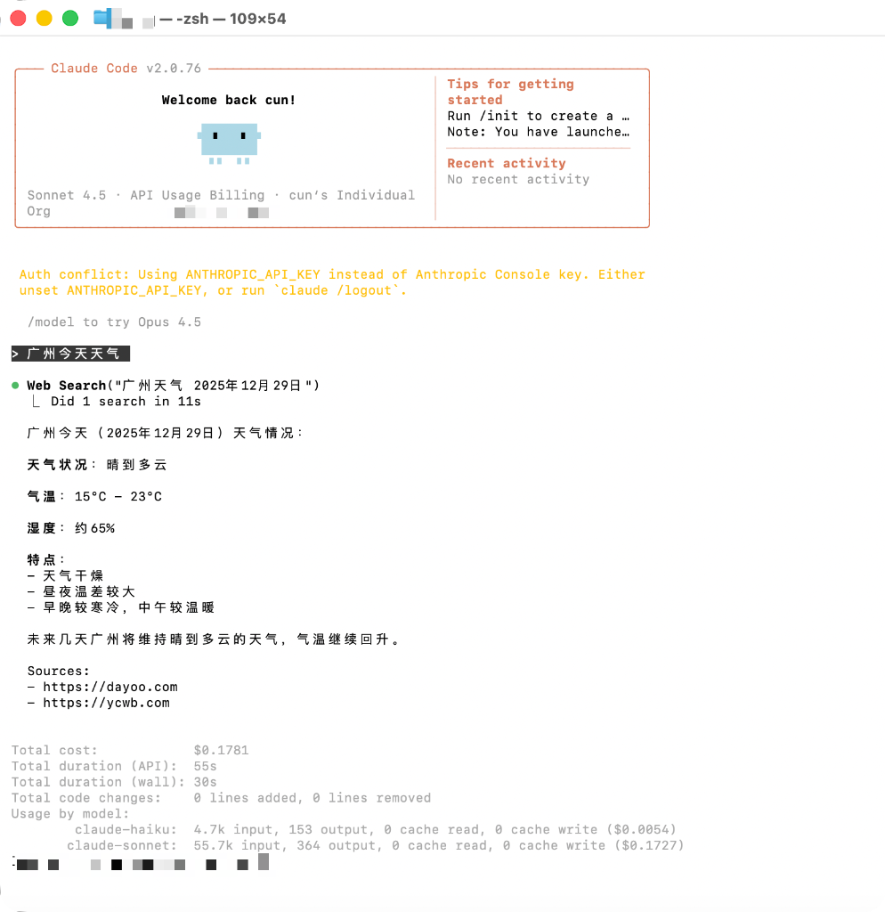 <br> Claude Code 聯網搜尋 | 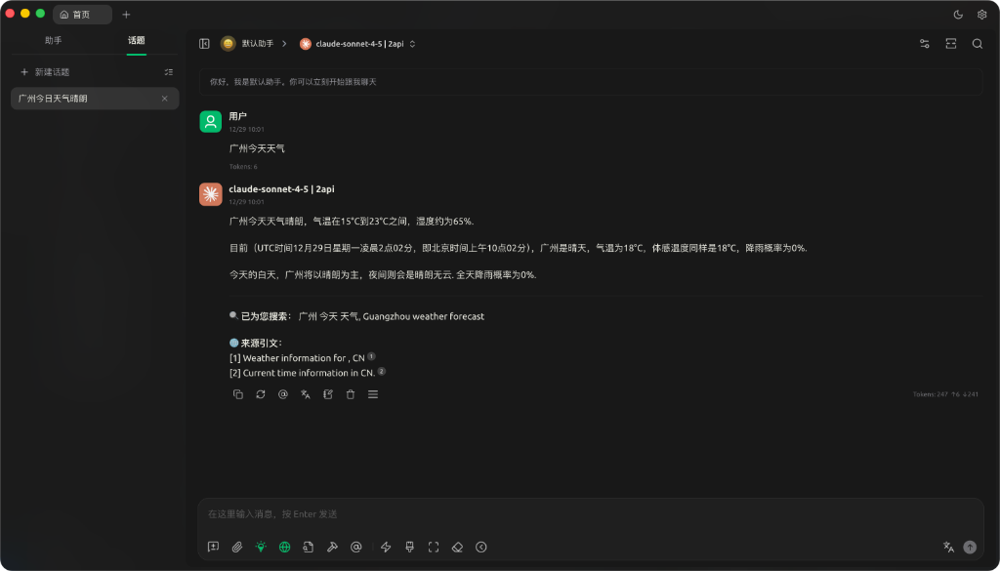 <br> Cherry Studio 深度整合 |
| 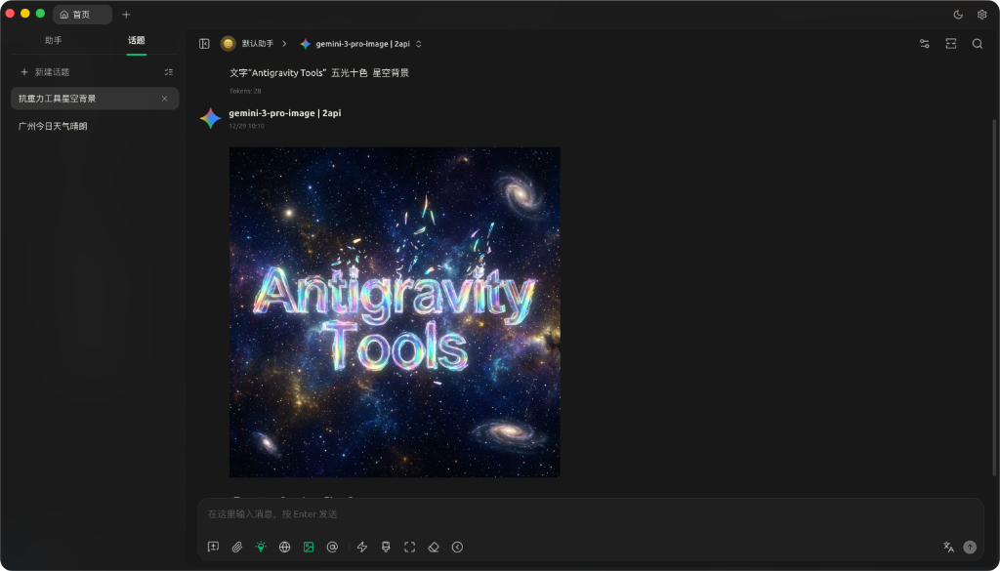 <br> Imagen 3 高階繪圖 | 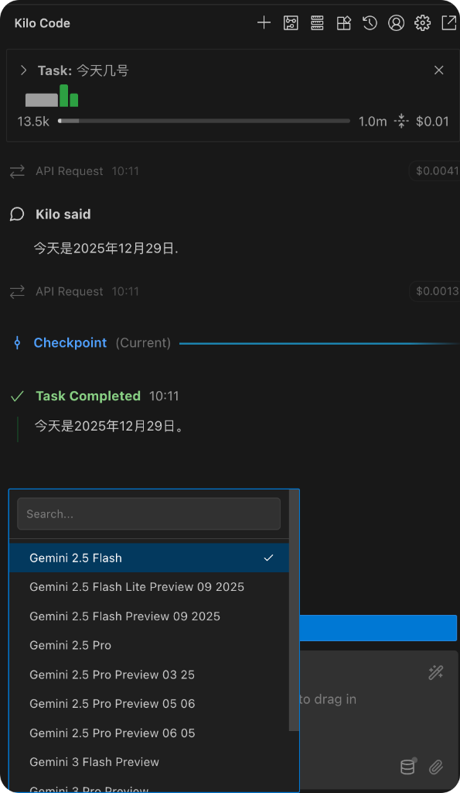 <br> Kilo Code 接入 |

## 🏗️ 技術架構 (Architecture)

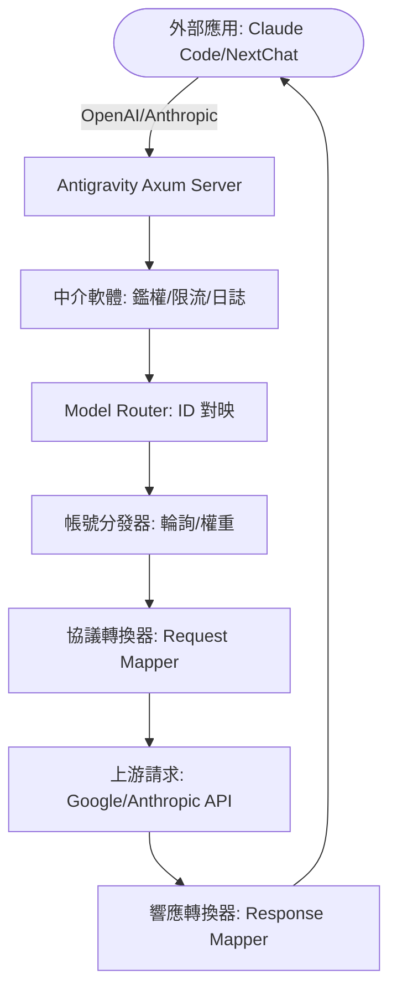

##  安裝指南 (Installation)

### 選項 A: 終端安裝 (推薦)

#### 跨平臺一鍵安裝指令碼

自動檢測作業系統、架構和包管理器，一條命令完成下載與安裝。

**Linux / macOS:**
```bash
curl -fsSL https://raw.githubusercontent.com/lbjlaq/Antigravity-Manager/main/install.sh | bash
```

**Windows (PowerShell):**
```powershell
irm https://raw.githubusercontent.com/lbjlaq/Antigravity-Manager/main/install.ps1 | iex
```

> **支援的格式**: Linux (`.deb` / `.rpm` / `.AppImage`) | macOS (`.dmg`) | Windows (NSIS `.exe`)
>
> **高階用法**: 安裝指定版本 `curl -fsSL https://raw.githubusercontent.com/lbjlaq/Antigravity-Manager/main/install.sh | bash -s -- --version 4.6.8`，預覽模式 `curl -fsSL https://raw.githubusercontent.com/lbjlaq/Antigravity-Manager/main/install.sh | bash -s -- --dry-run`

#### macOS - Homebrew
如果您已安裝 [Homebrew](https://brew.sh/)，也可以透過以下命令安裝：

```bash
# 1. 訂閱本倉庫的 Tap
brew tap lbjlaq/antigravity-manager https://github.com/lbjlaq/Antigravity-Manager

# 2. 安裝應用
brew install --cask antigravity-tools
```

#### Arch Linux
您可以選擇透過一鍵安裝指令碼或 Homebrew 進行安裝：

**方式 1：一鍵安裝指令碼 (推薦)**
```bash
curl -sSL https://raw.githubusercontent.com/lbjlaq/Antigravity-Manager/main/deploy/arch/install.sh | bash
```

**方式 2：透過 Homebrew** (如果您已安裝 [Linuxbrew](https://sh.brew.sh/))
```bash
brew tap lbjlaq/antigravity-manager https://github.com/lbjlaq/Antigravity-Manager
brew install --cask antigravity-tools
```

#### 其他 Linux 發行版
安裝後會自動將 AppImage 新增到二進位制路徑並配置可執行權限。

### 選項 B: 手動下載
前往 [GitHub Releases](https://github.com/lbjlaq/Antigravity-Manager/releases) 下載對應系統的包：
*   **macOS**: `.dmg` (支援 Apple Silicon & Intel)
*   **Windows**: `.msi` 或 便攜版 `.zip`
*   **Linux**: `.deb` 或 `AppImage`

### 選項 C: Docker 部署 (推薦用於 NAS/伺服器)
如果您希望在容器化環境中執行，我們提供了原生的 Docker 映象。該映象內建了對 v4.0.2 原生 Headless 架構的支援，可自動託管前端靜態資源，並透過瀏覽器直接進行管理。

```bash
# 方式 1: 直接執行 (推薦)
# - API_KEY: 必填。用於所有協議的 AI 請求鑑定。
# - WEB_PASSWORD: 可選。用於管理後臺登入。若不設定則預設使用 API_KEY。
docker run -d --name antigravity-manager \
  -p 8045:8045 \
  -e API_KEY=sk-your-api-key \
  -e WEB_PASSWORD=your-login-password \
  -e ABV_MAX_BODY_SIZE=104857600 \
  -v ~/.antigravity_tools:/root/.antigravity_tools \
  lbjlaq/antigravity-manager:latest

# 忘記金鑰？執行 docker logs antigravity-manager 或 grep -E '"api_key"|"admin_password"' ~/.antigravity_tools/gui_config.json

#### 🔐 鑑權邏輯說明
*   **場景 A：僅設定了 `API_KEY`**
    - **Web 登入**：使用 `API_KEY` 進入後臺。
    - **API 呼叫**：使用 `API_KEY` 進行 AI 請求鑑權。
*   **場景 B：同時設定了 `API_KEY` 和 `WEB_PASSWORD` (推薦)**
    - **Web 登入**：**必須**使用 `WEB_PASSWORD`，使用 API Key 將被拒絕（更安全）。
    - **API 呼叫**：統一使用 `API_KEY`。這樣您可以將 API Key 分發給成員，而保留密碼僅供管理員使用。

#### 🆙 舊版本升級指引
如果您是從 v4.0.1 及更早版本升級，系統預設未設定 `WEB_PASSWORD`。您可以透過以下任一方式設定：
1.  **Web UI 介面 (推薦)**：使用原有 `API_KEY` 登入後，在 **API 反代設定** 頁面手動設定並儲存。新密碼將持久化儲存在 `gui_config.json` 中。
2.  **環境變數 (Docker)**：在啟動容器時增加 `-e WEB_PASSWORD=您的新密碼`。**注意：環境變數具有最高優先順序，將覆蓋 UI 中的任何修改。**
3.  **配置檔案 (持久化)**：直接修改 `~/.antigravity_tools/gui_config.json`，在 `proxy` 物件中修改或新增 `"admin_password": "您的新密碼"` 欄位。
    - *注：`WEB_PASSWORD` 是環境變數名，`admin_password` 是配置檔案中的 JSON 鍵名。*

> [!TIP]
> **密碼優先順序邏輯 (Priority)**:
> - **第一優先順序 (環境變數)**: `ABV_WEB_PASSWORD` 或 `WEB_PASSWORD`。只要設定了環境變數，系統將始終使用它。
> - **第二優先順序 (配置檔案)**: `gui_config.json` 中的 `admin_password` 欄位。UI 的“儲存”操作會更新此值。
> - **保底回退 (向後相容)**: 若上述均未設定，則回退使用 `API_KEY` 作為登入密碼。

# 方式 2: 使用 Docker Compose
# 1. 進入專案的 docker 目錄
cd docker
# 2. 啟動服務
docker compose up -d
```
> **日誌輪轉**: Compose 預設將 JSON 日誌限制為單檔案 `100m`、保留 `3` 個檔案，避免日誌無限增長。
> **訪問地址**: `http://localhost:8045` (管理後臺) | `http://localhost:8045/v1` (API Base)
> **系統要求**:
> - **記憶體**: 建議 **1GB** (最小 256MB)。
> - **持久化**: 需掛載 `/root/.antigravity_tools` 以儲存資料。
> - **架構**: 支援 x86_64 和 ARM64。
> **詳情見**: [Docker 部署指南 (docker)](./docker/README.md)

---

<details>
<summary><b>🛠️ 常見問題排查 (Troubleshooting) - 點選展開</b></summary>

#### macOS 提示“應用已損壞，無法開啟”？
由於 macOS 的安全機制，非 App Store 下載的應用可能會觸發此提示。您可以按照以下步驟快速修復：

1.  **命令列修復** (推薦):
    開啟終端，執行以下命令：
    ```bash
    sudo xattr -rd com.apple.quarantine "/Applications/Antigravity Tools.app"
    ```
2.  **Homebrew 安裝優勢**:
    現在透過 Homebrew (`brew install --cask antigravity-tools`) 安裝時，系統會在安裝末尾自動執行清理屬性的操作，**真正實現開箱即用**。

#### Linux 視窗全黑 / 透明框？
在 niri、Hyprland、Sway 等合成器上，舊版本會因為會話裡總有 `DISPLAY` 而強制走 X11，WebKit 主介面可能全黑。請更新到包含該修復的版本；或臨時：

```bash
env WEBKIT_DISABLE_DMABUF_RENDERER=1 ANTIGRAVITY_FORCE_WAYLAND=1 antigravity-tools
```

- `ANTIGRAVITY_FORCE_WAYLAND=1`: 保持原生 Wayland（不強制切 X11）
- `ANTIGRAVITY_FORCE_X11=1`: 仍需走 X11 時強制啟用
- `WEBKIT_DISABLE_DMABUF_RENDERER=1`: 禁用 WebKit DMA-BUF 渲染器

</details>

## 🔌 快速接入示例

### 🔐 OAuth 授權流程（新增帳號）
1. 開啟“Accounts / 帳號” → “新增帳號” → “OAuth”。
2. 彈窗會在點選按鈕前預生成授權連結；點選連結即可複製到系統剪貼簿，然後用你希望的瀏覽器開啟並完成授權。
3. 授權完成後瀏覽器會開啟本地回撥頁並顯示“✅ 授權成功!”。
4. 應用會自動繼續完成授權並儲存帳號；如未自動完成，可點選“我已授權，繼續”手動完成。

> 提示：授權連結包含一次性回撥埠，請始終使用彈窗裡生成的最新連結；如果授權時應用未執行或彈窗已關閉，瀏覽器可能會提示 `localhost refused connection`。

### 如何接入 Claude Code CLI?
1.  啟動 Antigravity，並在“API 反代”頁面開啟服務。
2.  在終端執行：
```bash
export ANTHROPIC_API_KEY="sk-antigravity"
export ANTHROPIC_BASE_URL="http://127.0.0.1:8045"
claude
```

### 如何接入 OpenCode?
1.  進入 **API 反代**頁面 → **外部 Providers** → 點選 **OpenCode Sync** 卡片。
2.  點選 **Sync** 按鈕，將自動生成 `~/.config/opencode/opencode.json` 配置檔案：
    - 建立獨立 provider `antigravity-manager`（不覆蓋 google/anthropic 原生配置）
    - 可選：勾選 **Sync accounts** 匯出 `antigravity-accounts.json`（plugin-compatible v3 格式），供 OpenCode 外掛直接匯入
3.  點選 **Clear Config** 可一鍵清除 Manager 配置並清理 legacy 殘留；點選 **Restore** 可從備份恢復。
4.  Windows 使用者路徑為 `C:\Users\<使用者名稱>\.config\opencode\`（與 `~/.config/opencode` 規則一致）。

**快速驗證命令：**
```bash
# 測試 antigravity-manager provider（支援 --variant）
opencode run "test" --model antigravity-manager/claude-sonnet-4-5-thinking --variant high

# 若已安裝 opencode-antigravity-auth 外掛，驗證 google provider 仍可獨立工作
opencode run "test" --model google/antigravity-claude-sonnet-4-5-thinking --variant max
```

### 如何接入 Kilo Code?
1.  **協議選擇**: 建議優先使用 **Gemini 協議**。
2.  **Base URL**: 填寫 `http://127.0.0.1:8045`。
3.  **注意**: 
    - **OpenAI 協議限制**: Kilo Code 在使用 OpenAI 模式時，其請求路徑會疊加產生 `/v1/chat/completions/responses` 這種非標準路徑，導致 Antigravity 返回 404。因此請務必填入 Base URL 後選擇 Gemini 模式。
    - **模型對映**: Kilo Code 中的模型名稱可能與 Antigravity 預設設定不一致，如遇到無法連線，請在“模型對映”頁面設定自定義對映，並檢視**日誌檔案**進行除錯。

### 如何在 Python 中使用?
```python
import openai

client = openai.OpenAI(
    api_key="sk-antigravity",
    base_url="http://127.0.0.1:8045/v1"
)

response = client.chat.completions.create(
    model="gemini-3-flash",
    messages=[{"role": "user", "content": "你好，請自我介紹"}]
)
print(response.choices[0].message.content)
```

### 如何使用圖片生成 (Imagen 3)?

#### 方式一：OpenAI Images API (推薦)
```python
import openai

client = openai.OpenAI(
    api_key="sk-antigravity",
    base_url="http://127.0.0.1:8045/v1"
)

# 生成圖片
response = client.images.generate(
    model="gemini-3-pro-image",
    prompt="一座未來主義風格的城市，賽博朋克，霓虹燈",
    size="1920x1080",      # 支援任意 WIDTHxHEIGHT 格式，自動計算寬高比
    quality="hd",          # "standard" | "hd" | "medium"
    n=1,
    response_format="b64_json"
)

# 儲存圖片
import base64
image_data = base64.b64decode(response.data[0].b64_json)
with open("output.png", "wb") as f:
    f.write(image_data)
```

**支援的引數**：
- **`size`**: 任意 `WIDTHxHEIGHT` 格式（如 `1280x720`, `1024x1024`, `1920x1080`），自動計算並對映到標準寬高比（21:9, 16:9, 9:16, 4:3, 3:4, 1:1）
- **`quality`**: 
  - `"hd"` → 4K 解析度（高質量）
  - `"medium"` → 2K 解析度（中等質量）
  - `"standard"` → 預設解析度（標準質量）
- **`n`**: 生成圖片數量（1-10）
- **`response_format`**: `"b64_json"` 或 `"url"`（Data URI）

<details>
<summary><b>🎨 展開檢視更多圖片呼叫方式與引數對映規則 (Chat API / 模型字尾 / Cherry Studio)</b></summary>

#### 方式二：Chat API + 引數設定 (✨ 新增)

**所有協議**（OpenAI、Claude）的 Chat API 現在都支援直接傳遞 `size` 和 `quality` 引數：

```python
# OpenAI Chat API
response = client.chat.completions.create(
    model="gemini-3-pro-image",
    size="1920x1080",      # ✅ 支援任意 WIDTHxHEIGHT 格式
    quality="hd",          # ✅ "standard" | "hd" | "medium"
    messages=[{"role": "user", "content": "一座未來主義風格的城市"}]
)
```

```bash
# Claude Messages API
curl -X POST http://127.0.0.1:8045/v1/messages \
  -H "Content-Type: application/json" \
  -H "x-api-key: sk-antigravity" \
  -d '{
    "model": "gemini-3-pro-image",
    "size": "1280x720",
    "quality": "hd",
    "messages": [{"role": "user", "content": "一隻可愛的貓咪"}]
  }'
```

**引數優先順序**: `imageSize` 引數 > `quality` 引數 > 模型字尾

**✨ 新增 `imageSize` 引數支援**:

除了 `quality` 引數外，現在還支援直接使用 Gemini 原生的 `imageSize` 引數:

```python
# 使用 imageSize 引數(最高優先順序)
response = client.chat.completions.create(
    model="gemini-3-pro-image",
    size="16:9",           # 寬高比
    imageSize="4K",        # ✨ 直接指定解析度: "1K" | "2K" | "4K"
    messages=[{"role": "user", "content": "一座未來主義風格的城市"}]
)
```

```bash
# Claude Messages API 也支援 imageSize
curl -X POST http://127.0.0.1:8045/v1/messages \
  -H "Content-Type: application/json" \
  -H "x-api-key: sk-antigravity" \
  -d '{
    "model": "gemini-3-pro-image",
    "size": "1280x720",
    "imageSize": "4K",
    "messages": [{"role": "user", "content": "一隻可愛的貓咪"}]
  }'
```

**引數說明**:
- **`imageSize`**: 直接指定解析度 (`"1K"` / `"2K"` / `"4K"`)
- **`quality`**: 透過質量等級推斷解析度 (`"standard"` → 1K, `"medium"` → 2K, `"hd"` → 4K)
- **優先順序**: 如果同時指定 `imageSize` 和 `quality`, 系統會優先使用 `imageSize`

#### 方式三：Chat 介面 + 模型字尾
```python
response = client.chat.completions.create(
    model="gemini-3-pro-image-16-9-4k",  # 格式：gemini-3-pro-image-[比例]-[質量]
    messages=[{"role": "user", "content": "一座未來主義風格的城市"}]
)
```

**模型字尾說明**：
- **寬高比**: `-16-9`, `-9-16`, `-4-3`, `-3-4`, `-21-9`, `-1-1`
- **質量**: `-4k` (4K), `-2k` (2K), 不加字尾（標準）
- **示例**: `gemini-3-pro-image-16-9-4k` → 16:9 比例 + 4K 解析度

#### 方式四：Cherry Studio 等客戶端設定
在支援 OpenAI 協議的客戶端（如 Cherry Studio）中，可以透過**模型設定**頁面配置圖片生成引數：

1. **進入模型設定**：選擇 `gemini-3-pro-image` 模型
2. **配置引數**：
   - **Size (尺寸)**: 輸入任意 `WIDTHxHEIGHT` 格式（如 `1920x1080`, `1024x1024`）
   - **Quality (質量)**: 選擇 `standard` / `hd` / `medium`
   - **Number (數量)**: 設定生成圖片數量（1-10）
3. **傳送請求**：直接在對話方塊中輸入圖片描述即可

**引數對映規則**：
- `size: "1920x1080"` → 自動計算為 `16:9` 寬高比
- `quality: "hd"` → 對映為 `4K` 解析度
- `quality: "medium"` → 對映為 `2K` 解析度

</details>

## 📝 更新日誌

> 最新版本 **v4.8.1**（2026-09-25）：全面重構四大協議中轉報文，引入確定性鍵序排序與拓撲拉齊，實現跨協議來回切換轉出報文 100% 位元組級一致，長上下文字首快取（Prefix Caching）通用不崩塌；徹底解決 Claude 與 Gemini 協議切換思考簽名不同引發的異常，支援 `<think>` 標籤包裝及原生思考塊無損提升與簽名因果召回；全面拋棄客戶端隨機 tool_id，改用上下文因果確定性偽雜湊 ID 統一雙向檢索；全面打通 Agent 視覺鏈路，支援工具結果中 Base64 圖片原生轉換為 Gemini 視覺輸入載荷；全面拔除介面卡層歷史遺留的 `web_search` 工具過濾與硬編碼死程式碼，統一收斂至 Pipeline 集中治理；修復客戶端預算模式下關閉思考偶發失效的問題；新增 JeikCode、Hermes、OpenClaw、Grok Build 等 Agent 客戶端一鍵配置卡片與無邊框正方形 App 圖示生態；新增全語言自適應版本升級清理思考塊快取建議彈窗。

👉 **[檢視完整更新日誌 CHANGELOG.md →](CHANGELOG.md)**

<details>
<summary><b>👥 核心貢獻者 (Contributors) - 點選展開</b></summary>

感謝所有為本專案付出汗水與智慧的開發者，完整名單請見上游倉庫的 [Contributors 頁面](https://github.com/lbjlaq/Antigravity-Manager/graphs/contributors)。

</details>

<details>
<summary><b>🤝 鳴謝專案 (Special Thanks) - 點選展開</b></summary>

本專案在開發過程中參考或借鑑了以下優秀開源專案的思路或程式碼，排名不分先後：

*   [learn-claude-code](https://github.com/shareAI-lab/learn-claude-code)
*   [Practical-Guide-to-Context-Engineering](https://github.com/WakeUp-Jin/Practical-Guide-to-Context-Engineering)
*   [CLIProxyAPI](https://github.com/router-for-me/CLIProxyAPI)
*   [OmniRoute](https://github.com/diegosouzapw/OmniRoute)
*   [antigravity-claude-proxy](https://github.com/badrisnarayanan/antigravity-claude-proxy)
*   [aistudio-gemini-proxy](https://github.com/zhongruichen/aistudio-gemini-proxy)
*   [gcli2api](https://github.com/su-kaka/gcli2api)
*   [agent-vibes](https://github.com/funny-vibes/agent-vibes)

</details>

*   **版權許可**: 基於 **CC BY-NC-SA 4.0** 許可，**嚴禁任何形式的商業行為**。
*   **安全聲明**: 本應用所有帳號資料加密儲存於本地 SQLite 資料庫，除非開啟同步功能，否則資料絕不離開您的裝置。

---

<div align="center">
  <p>本專案 fork 自 <a href="https://github.com/lbjlaq/Antigravity-Manager">lbjlaq/Antigravity-Manager</a>，依 CC BY-NC-SA 4.0 授權。</p>
</div>
